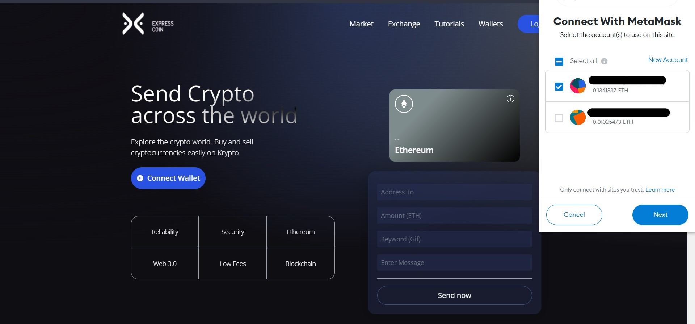
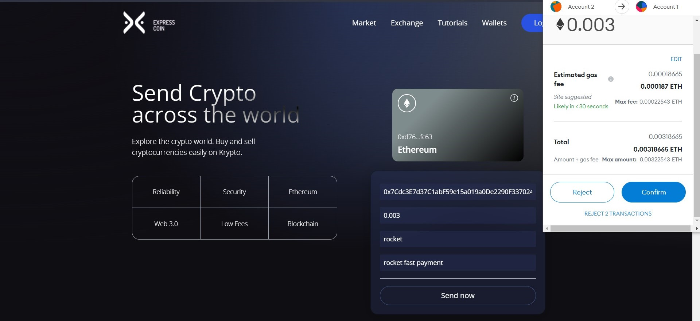
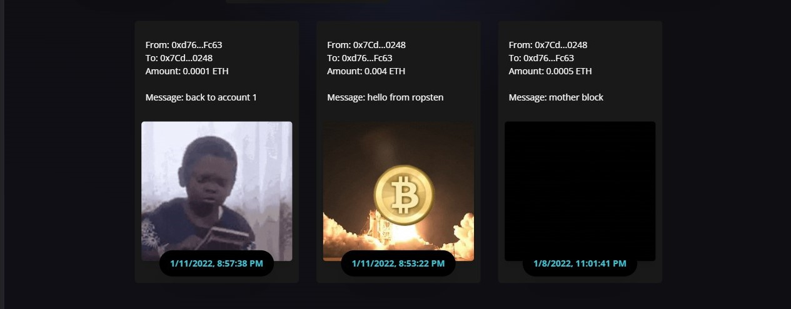

# Express-Coin
A solidity powered react application to transfer ethereum anywhere in the world in fast and safe way.

## Live Demo
https://expresscoin.netlify.app

## Features
Users can connect their ethereum wallet such as MetaMask and transfer ethereum to any other ethereum wallet on the same network.

The transaction is stored as a gif and posted in the block section of the application.

User also can verify the transaction on etherscan by clicking on "_To: xxxxxxxxx_" of any block.

## Tech
- ReactJS
- TailWindCSS
- Ethereum
- Solidity

